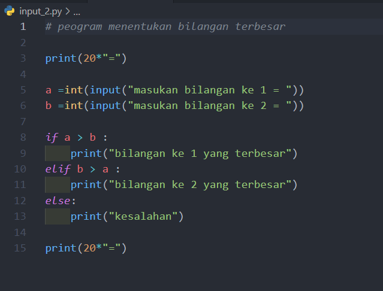
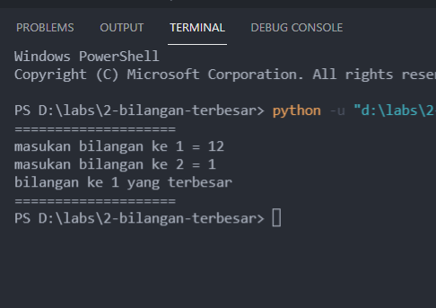

# PYHTON 7
======================= PROGRAM KE 1 =======================
* menentukan bilangan terbesar dari 2 bilangan yang di input kan
* program ini di buat menggunakan kondisi if, elif dan else
* dan program ini juga menggunakan operator pembanding

        INPUT

        OUTPUT

======================= PROGRAM KE 2 =======================

* mengurutkan data dari yang terkecil dari beberapa inputan
* program ini di buat terdiri dari banyak inputan dan list
* program ini menggunakan selection sort (untuk menentukan data dari yang terkecil)

        INPUT

        OUTPUT
        

======================= PROGRAM KE 3 =======================

