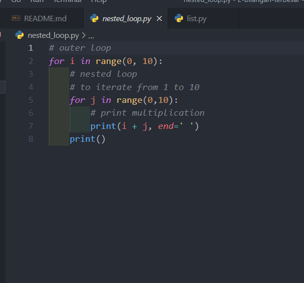
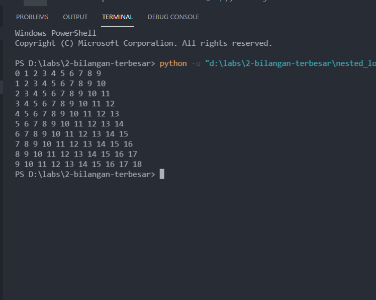
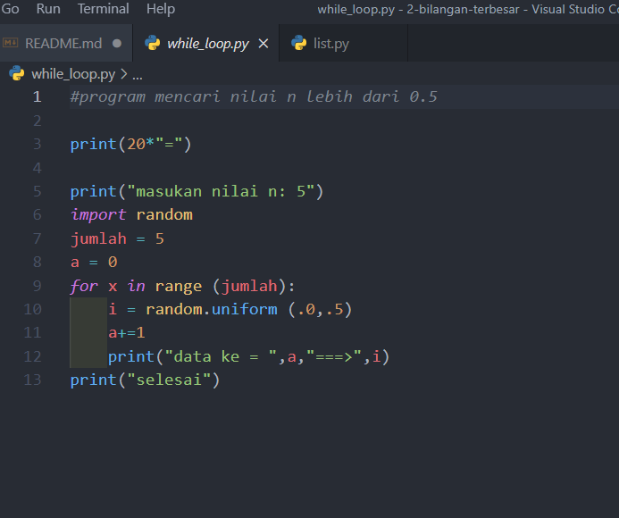
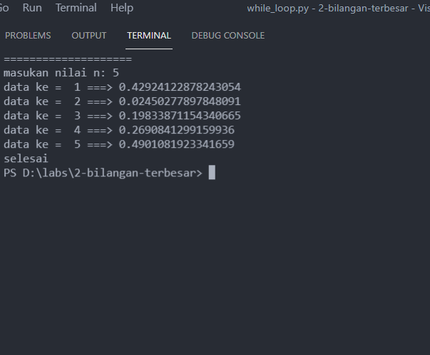

# PYHTON 7
======================= PROGRAM KE 1 =======================
* menentukan bilangan terbesar dari 2 bilangan yang di input kan
* program ini di buat menggunakan kondisi if, elif dan else
* dan program ini juga menggunakan operator pembanding

        INPUT

        OUTPUT

======================= PROGRAM KE 2 =======================
* mengurutkan data dari yang terkecil dari beberapa inputan
* program ini di buat terdiri dari banyak inputan dan list
* program ini menggunakan selection sort (untuk menentukan data dari yang terkecil)

        INPUT

        OUTPUT

======================= PROGRAM KE 3 =======================
* membuat program perulangan bertingkat (nested) for
* program ini di buat menggunakan perulangan/looping (for)
* range yang merupakan jarak / batasan
* nested loop adalah membuat program perulangan di dalam perulangan

        INPUT

* [for i] yang di dalam nya ada [for j]
* dan range 1..10 artrinya di mulai dari angka 0 dan di akhiri angka 9

        OUTPUT

======================= PROGRAM KE 4 =======================
* Tampilkan n bilangan acak yang lebih kecil dari 0.5.
* program ini di buat menggunakan while loop dan for loop
* import random mempunya fungsi menampilkan nilai / huruf acak

        INPUT

        OUTPUT

======================= TERIMAKASIH =======================